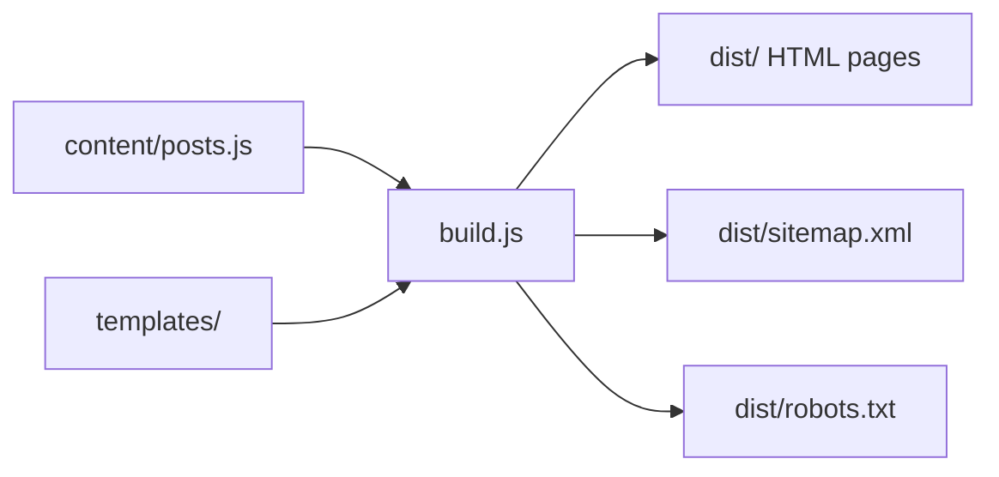

# Design Document: Gaming Blog Website

## Overview

A static gaming blog website with AI-generated content, built as a collection of HTML/CSS/JS files. The site covers game reviews, top 10 lists, game mechanics, walkthroughs, and gaming news — at least 15 distinct pages. All SEO metadata, structured data, and semantic HTML are baked into each page at build time.

The site is a pure static site (no server-side rendering, no database) for simplicity, portability, and fast load times. A lightweight build script generates all pages from a content data file, injecting SEO tags, structured data, navigation, and image references consistently across every page.

### Technology Choices

- **HTML5 / CSS3 / Vanilla JS** — no framework dependency, maximum portability
- **Node.js build script** — generates all HTML pages from templates + content data
- **Google Fonts** — typography (loaded via `<link>`)
- **JSON-LD** — structured data embedded in `<script type="application/ld+json">` blocks
- **Public image URLs** — sourced from Unsplash or similar free-to-use CDNs

---

## Architecture

The site follows a static site generation (SSG) pattern:

```
content/
  posts.js          ← all blog post data (title, body, category, images, metadata)
  pages.js          ← static page data (about, contact)

templates/
  base.html         ← shared shell: <head>, nav, footer
  post.html         ← blog post layout
  category.html     ← category listing layout
  index.html        ← homepage layout

build.js            ← Node.js script that reads content + templates → writes dist/

dist/               ← generated output (deployable)
  index.html
  about.html
  contact.html
  sitemap.xml
  robots.txt
  posts/
    [slug].html
  category/
    [slug].html

assets/
  css/
    style.css
  js/
    main.js         ← lazy-load, focus indicators, image fallback
```



---

## Components and Interfaces

### SEO Module

Responsible for generating all `<head>` content for a given page. Called by `build.js` for every page.

```js
/**
 * @param {PageMeta} meta
 * @returns {string} HTML string of <head> tags
 */
function buildHead(meta) { ... }
```

Outputs:
- `<title>` (50–60 chars)
- `<meta name="description">` (150–160 chars)
- `<meta property="og:*">` (blog posts only)
- `<link rel="canonical">`
- `<meta name="viewport">`
- `<html lang="en">`
- JSON-LD `Article` (blog posts) or `WebSite` (homepage)

### Navigation Component

A shared HTML partial injected into every page's `<header>`. Links: Home, Reviews, Top Lists, Tips & Tricks, Game Mechanics, Gaming News, About, Contact.

### Breadcrumb Component

Injected on blog post pages only. Format: `Home > {Category} > {Post Title}`. Also emits JSON-LD `BreadcrumbList` structured data.

### Blog Post Card Component

Used on the homepage and category listing pages. Renders: Hero_Image thumbnail, title, category label, publication date, excerpt.

### Image Fallback Handler (`main.js`)

Attaches `onerror` handlers to all `` elements. On failure, replaces `src` with a styled placeholder `<div>` showing the `alt` text.

### Lazy Load Handler (`main.js`)

Uses `IntersectionObserver` to set `src` from `data-src` on images below the fold.

---

## Data Models

### Post

```ts
interface Post {
  slug: string;           // URL-safe identifier, e.g. "top-10-games-2024"
  title: string;          // Page <h1> and <title> base
  seoTitle: string;       // 50–60 char <title> tag value
  metaDescription: string;// 150–160 char meta description
  category: Category;     // one of the five categories
  datePublished: string;  // ISO 8601, e.g. "2024-11-01"
  author: string;         // author name for JSON-LD
  heroImage: ImageRef;    // primary image
  images: ImageRef[];     // additional in-body images
  excerpt: string;        // short summary for cards (~160 chars)
  body: string;           // full HTML body content (≥400 words)
  relatedSlugs: string[]; // slugs of ≥2 related posts (same category)
  internalLinks: InternalLink[]; // links to other posts within body
}
```

### ImageRef

```ts
interface ImageRef {
  url: string;      // public image URL
  alt: string;      // descriptive alt text with keyword
  width: number;    // display width in px (hero ≥ 600)
  height: number;
}
```

### Category

```ts
type Category =
  | "reviews"
  | "top-lists"
  | "tips-tricks"
  | "game-mechanics"
  | "gaming-news";
```

### PageMeta

```ts
interface PageMeta {
  seoTitle: string;
  metaDescription: string;
  canonicalUrl: string;
  ogImage?: string;       // blog posts only
  isPost: boolean;
  isHomepage: boolean;
  post?: Post;            // present when isPost = true
}
```

### InternalLink

```ts
interface InternalLink {
  targetSlug: string;
  anchorText: string;
}
```

### Site Content Inventory (minimum)

| # | Type | Title | Category |
|---|------|-------|----------|
| 1 | Homepage | Gaming Hub — Home | — |
| 2 | About | About Us | — |
| 3 | Contact | Contact | — |
| 4 | Category | Reviews | reviews |
| 5 | Category | Top Lists | top-lists |
| 6 | Category | Tips & Tricks | tips-tricks |
| 7 | Category | Game Mechanics | game-mechanics |
| 8 | Category | Gaming News | gaming-news |
| 9 | Post | Top 10 Games of 2024 | top-lists |
| 10 | Post | Elden Ring Review | reviews |
| 11 | Post | Baldur's Gate 3 Review | reviews |
| 12 | Post | Alan Wake 2 Review | reviews |
| 13 | Post | How Soulslike Combat Works | game-mechanics |
| 14 | Post | Understanding Roguelike Progression | game-mechanics |
| 15 | Post | Elden Ring Boss Guide: Margit | tips-tricks |
| 16 | Post | Beginner's Guide to BG3 | tips-tricks |
| 17 | Post | Gaming Industry Trends 2024 | gaming-news |

That's 18 pages (≥15 required).


---

## Correctness Properties

*A property is a characteristic or behavior that should hold true across all valid executions of a system — essentially, a formal statement about what the system should do. Properties serve as the bridge between human-readable specifications and machine-verifiable correctness guarantees.*

### Property 1: Minimum page count

*For any* generated site, the total number of distinct HTML files in `dist/` must be ≥ 15.

**Validates: Requirements 1.1**

---

### Property 2: All categories have a listing page

*For any* of the five defined categories (reviews, top-lists, tips-tricks, game-mechanics, gaming-news), a corresponding category listing page must exist in `dist/category/`.

**Validates: Requirements 1.2**

---

### Property 3: Homepage links to all posts

*For any* set of posts in the content data, the generated `dist/index.html` must contain an `<a href>` pointing to every post's slug URL.

**Validates: Requirements 1.3**

---

### Property 4: Category minimum post counts

*For any* generated site, the reviews category must have ≥ 3 posts, game-mechanics ≥ 2, tips-tricks ≥ 2, and gaming-news ≥ 1.

**Validates: Requirements 2.3, 2.4, 2.5, 2.6**

---

### Property 5: Body word count ≥ 400

*For any* blog post page, stripping HTML tags from the body content and counting whitespace-delimited tokens must yield a count ≥ 400.

**Validates: Requirements 2.7**

---

### Property 6: Title tag length in range

*For any* generated page, the text content of the `<title>` element must have length ≥ 50 and ≤ 60 characters, and all title values across pages must be unique.

**Validates: Requirements 3.1**

---

### Property 7: Meta description length in range

*For any* generated page, the `content` attribute of `<meta name="description">` must have length ≥ 150 and ≤ 160 characters, and all description values across pages must be unique.

**Validates: Requirements 3.2**

---

### Property 8: Blog post head completeness

*For any* blog post page, the `<head>` must contain: `og:title`, `og:description`, `og:image` meta tags; a `<link rel="canonical">`; and a valid JSON-LD `<script type="application/ld+json">` block with `@type: "Article"` including `headline`, `author`, `datePublished`, and `image` fields.

**Validates: Requirements 3.3, 3.4, 3.5**

---

### Property 9: Single h1 per page

*For any* generated page, the count of `<h1>` elements must equal exactly 1.

**Validates: Requirements 3.7**

---

### Property 10: Body sections use h2/h3

*For any* blog post page, at least one `<h2>` element must be present in the article body.

**Validates: Requirements 3.8**

---

### Property 11: Sitemap contains all pages

*For any* generated site, `dist/sitemap.xml` must contain a `<loc>` entry for every HTML page URL in `dist/`.

**Validates: Requirements 3.9**

---

### Property 12: No images missing alt text

*For any* generated page, every `` element must have a non-empty `alt` attribute.

**Validates: Requirements 3.11, 5.2**

---

### Property 13: Navigation links on every page

*For any* generated page, the `<nav>` element must contain `<a>` tags linking to: `/index.html`, `/category/reviews.html`, `/category/top-lists.html`, `/category/tips-tricks.html`, `/category/game-mechanics.html`, `/category/gaming-news.html`, `/about.html`, and `/contact.html`.

**Validates: Requirements 4.2, 6.1**

---

### Property 14: Footer links on every page

*For any* generated page, the `<footer>` element must contain `<a>` tags linking to `/about.html` and `/contact.html`.

**Validates: Requirements 4.3**

---

### Property 15: Homepage cards contain required fields

*For any* set of posts, each blog post card rendered on the homepage must contain: an `` (hero thumbnail), the post title, the category label, the publication date, and the excerpt text.

**Validates: Requirements 4.4**

---

### Property 16: Hero image present on post pages

*For any* blog post page, an `` element with the hero image URL must appear before the article body content in the DOM.

**Validates: Requirements 4.5, 5.1**

---

### Property 17: Hero image width ≥ 600px

*For any* hero image, the `width` attribute on the `` element must be ≥ 600.

**Validates: Requirements 5.3**

---

### Property 18: Category pages list all category posts

*For any* category, the generated category listing page must contain a link to every post whose `category` field matches that category.

**Validates: Requirements 6.2**

---

### Property 19: Breadcrumb has three correct items

*For any* blog post page, the breadcrumb navigation must contain exactly three items in order: "Home", the post's category display name, and the post's title.

**Validates: Requirements 6.3**

---

### Property 20: Internal links rendered in body

*For any* blog post with defined `internalLinks`, the rendered body HTML must contain an `<a href>` pointing to each linked post's slug URL.

**Validates: Requirements 6.4**

---

### Property 21: Related posts section has ≥ 2 same-category links

*For any* blog post page, a "Related Posts" section must exist containing ≥ 2 `<a>` links pointing to other posts in the same category.

**Validates: Requirements 6.5**

---

### Property 22: lang="en" on every page

*For any* generated page, the `<html>` element must have the attribute `lang="en"`.

**Validates: Requirements 7.2**

---

### Property 23: Viewport meta tag on every page

*For any* generated page, a `<meta name="viewport" content="width=device-width, initial-scale=1">` tag must be present in `<head>`.

**Validates: Requirements 7.5**

---

## Error Handling

### Image Load Failures (Req 5.4)

`main.js` attaches an `onerror` handler to every ``. On failure:
1. The `` is replaced with a `<div class="img-fallback">` containing the original `alt` text.
2. The fallback div is styled with a neutral background and centered text.

### Build-Time Validation

`build.js` validates the content data before generating any files:
- Throws if any post has `body` word count < 400
- Throws if any `seoTitle` is outside [50, 60] chars
- Throws if any `metaDescription` is outside [150, 160] chars
- Throws if any post has `relatedSlugs.length < 2`
- Throws if any `heroImage.width < 600`
- Logs a warning for any duplicate `seoTitle` or `metaDescription`

### Missing Content Graceful Degradation

- If `relatedSlugs` references a slug that doesn't exist in the post list, the build logs a warning and skips that related post rather than crashing.
- If an `internalLink.targetSlug` doesn't resolve, the link is omitted from the rendered body.

---

## Testing Strategy

### Dual Testing Approach

Both unit tests and property-based tests are required. They are complementary:
- Unit tests cover specific examples, edge cases, and integration points
- Property tests verify universal invariants across all generated content

### Property-Based Testing

**Library**: [fast-check](https://github.com/dubzzz/fast-check) (JavaScript/Node.js)

Each property test runs a minimum of **100 iterations**.

Each test is tagged with a comment in the format:
`// Feature: gaming-blog-website, Property N: <property_text>`

| Property | Test Description |
|----------|-----------------|
| P1 | Generate arbitrary post lists (≥15 items), run build, count HTML files |
| P2 | For each of 5 categories, assert category page exists after build |
| P3 | Generate arbitrary post list, parse index.html, assert all slugs linked |
| P4 | Assert category counts meet minimums from content data |
| P5 | For any post, strip HTML from body, count words, assert ≥ 400 |
| P6 | For any page, parse `<title>`, assert length in [50,60] and uniqueness |
| P7 | For any page, parse meta description, assert length in [150,160] and uniqueness |
| P8 | For any post page, assert og:*, canonical, and JSON-LD Article all present |
| P9 | For any page, count `<h1>` elements, assert exactly 1 |
| P10 | For any post page, assert ≥ 1 `<h2>` in article body |
| P11 | Parse sitemap.xml, assert every page URL appears as `<loc>` |
| P12 | For any page, assert every `` has non-empty alt |
| P13 | For any page, parse nav, assert all 8 required hrefs present |
| P14 | For any page, parse footer, assert about and contact links present |
| P15 | For any post card on homepage, assert all 5 required fields present |
| P16 | For any post page, assert hero `` precedes article body in DOM |
| P17 | For any post page, assert hero img width attribute ≥ 600 |
| P18 | For any category, parse category page, assert all matching posts linked |
| P19 | For any post page, parse breadcrumb, assert 3 items in correct order |
| P20 | For any post with internalLinks, assert each target slug linked in body |
| P21 | For any post page, parse related posts section, assert ≥ 2 same-category links |
| P22 | For any page, assert `<html lang="en">` |
| P23 | For any page, assert viewport meta tag present |

### Unit Tests

Focus on specific examples and edge cases:

- **Example**: Homepage exists and contains the "Top 10 Games of 2024" post link (Req 2.2)
- **Example**: `dist/about.html` and `dist/contact.html` exist (Req 1.4)
- **Example**: `dist/robots.txt` exists and contains `Allow: /` (Req 3.10)
- **Example**: Homepage `<head>` contains JSON-LD with `@type: "WebSite"` (Req 3.6)
- **Example**: Body font-size in `style.css` is ≥ 16px (Req 4.7)
- **Example**: Image fallback handler — simulate `onerror`, assert fallback div rendered with alt text (Req 5.4)
- **Example**: Lazy-load — non-hero images use `data-src` attribute, not `src` (Req 7.1)
- **Edge case**: Post with exactly 400 words passes word count validation
- **Edge case**: `seoTitle` of exactly 50 chars and exactly 60 chars both pass validation
- **Edge case**: `metaDescription` of exactly 150 chars and exactly 160 chars both pass validation
